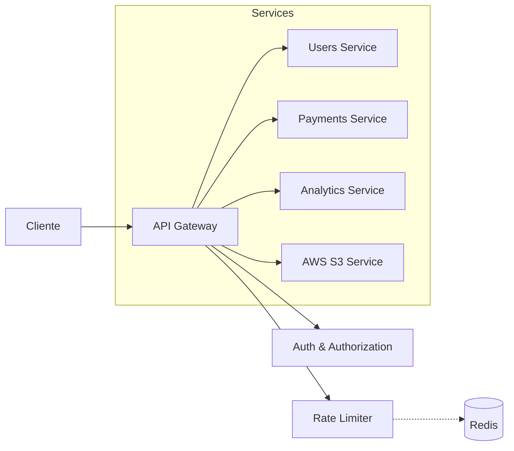

# 🚀 SocialBeats API Gateway

Una **API Gateway** avanzada desarrollada en **Express.js** que actúa como punto de entrada único para la arquitectura de microservicios de SocialBeats.

[](https://nodejs.org/)
[](https://expressjs.com/)
[](https://www.docker.com/)
[](https://redis.io/)
[](https://aws.amazon.com/s3/)
[](LICENSE)

---

## 📖 Documentación

Hemos fragmentado la documentación para facilitar su lectura:

- **[🔧 Guía de Instalación](docs/INSTALLATION.md)**: Pasos detallados para correr el proyecto en Local, Docker y Docker Compose.
- **[🧩 Microservicios y Arquitectura](docs/MICROSERVICES.md)**: Cómo añadir nuevos servicios y entender los middlewares (Auth, Rate Limit, Circuit Breaker).
- **[📡 Referencia de API](docs/API.md)**: Lista de endpoints y detalles de autenticación.

---

## ⚡ Inicio Rápido

Para los impacientes, aquí tienes cómo levantar el entorno de desarrollo completo con Docker Compose:

```bash
# 1. Instalar dependencias
npm install

# 2. Configurar entorno
npm run env:compose

# 3. Levantar todo (Gateway + Redis)
npm run dev:compose
```

La API estará disponible en `http://localhost:3000`.

---

## 🏗️ Arquitectura



### Características Clave

- **Autenticación Centralizada**: Validación JWT y propagación de identidad (`authentication.js`).
- **Autorización Basada en Roles**: Middleware flexible para control de acceso (`authorization.js`).
- **Rate Limiting Dinámico**: Cuotas basadas en planes de suscripción usando Redis (`rateLimiter.js`).
- **Resiliencia**: Implementación de Circuit Breaker para fallos en cascada (`circuitBreaker.js`).
- **Proxy Inteligente**: Enrutamiento dinámico a microservicios usando `http-proxy-middleware` (`proxy.js`).
- **Agregación de Datos**: Endpoints que combinan respuestas de múltiples servicios para reducir latencia (`aggregationService.js`).
- **Gestión de Archivos**: Integración nativa con AWS S3 para subida y descarga segura (`s3.service.js`).
- **Respuestas Estandarizadas**: Utilidades para mantener consistencia en respuestas de éxito y error (`response.js`).

---

## 📏 Estándares de Código

Para mantener la calidad y consistencia del proyecto, seguimos estas reglas estrictas:

1.  **Logs**: Todos los logs del sistema (`logger.info`, `logger.error`, etc.) deben estar en **Inglés**.
2.  **Respuestas HTTP**: Los mensajes devueltos al cliente en el JSON deben estar en **Inglés**.
3.  **Comentarios**: Toda la documentación interna del código (JSDoc, comentarios inline) debe estar en **Español**.

---

## 🛠️ Tecnologías Principales

- **Core**: Node.js, Express.js
- **Seguridad**: Helmet, CORS, JWT
- **Resiliencia**: Opossum (Circuit Breaker), Express Rate Limit
- **Infraestructura**: Docker, Redis, AWS SDK
- **Testing**: Vitest, Supertest

---

## 🤝 Contribución

1. Haz fork del repositorio.
2. Crea tu rama de feature (`git checkout -b feature/amazing-feature`).
3. Commit de tus cambios (`git commit -m 'Add some amazing feature'`).
4. Push a la rama (`git push origin feature/amazing-feature`).
5. Abre un Pull Request.
